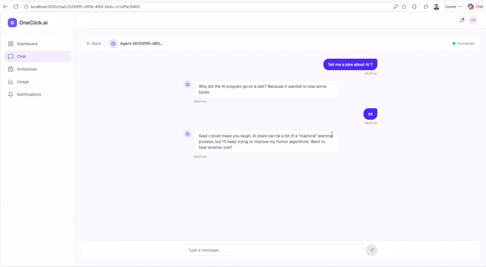

# OneClick.ai

**Your AI Workforce. One Click.**

Open-source MicroVM based infrastructure for deploying and managing AI employees within your organization. Clone, configure, run — every team member gets a personal AI agent that works 24/7, executes tasks on schedule, and costs nothing when idle.

---

## Demo

### 🤖 Create an Agent
Choose a model, click create — your agent spins up in a Firecracker microVM in seconds.

<p align="center">
  
</p>

### 💬 Chat with Your Agent
Real-time conversation with token streaming. Your agent has full coding capabilities powered by OpenClaw.

<p align="center">
  
</p>

### 📊 Usage Tracking
Monitor token usage per agent — daily and all-time stats, rate limits, and cost tracking.

<p align="center">
  
</p>

---

## Why OneClick.ai?

Keeping an AI agent constantly running is **expensive and wasteful**. Most agents sit idle 90%+ of the time — burning CPU, RAM, and money while waiting for the next interaction. Cloud-hosted agent platforms charge you for that idle time. Self-hosted solutions leave VMs running 24/7.

**OneClick.ai solves this with Firecracker microVMs and snapshot-based hibernation.** When an agent isn't being used, we snapshot its entire memory state and shut down the VM — zero CPU, zero RAM. When a user comes back, we restore the snapshot and the agent picks up exactly where it left off, in under a second. You only pay for compute when agents are actually working.

The entire backend is written in **Rust** — memory-efficient, deterministic, and with no garbage collector pauses. This means the orchestration layer itself has a minimal footprint, so your server's resources go to the agents, not the platform.

| Problem | Solution |
|---------|----------|
| Running AI agents 24/7 is expensive | **Snapshot & sleep**: idle agents use 0 CPU/RAM, restore in <1s |
| AI assistants are stateless (ChatGPT forgets everything) | Agents persist state, memory, and context across sessions via microVM snapshots |
| Setting up AI agents requires deep technical knowledge | One setup script — done |
| LLM API keys scattered across tools | Centralized LLM proxy with usage tracking and rate limiting |
| No scheduling or automation | Built-in cron scheduler — agents execute tasks while you sleep |

## Who Is This For?

- **Engineering teams** wanting internal AI assistants for code review, monitoring, research
- **Small businesses** needing AI employees for support, sales, scheduling
- **Developers** building on top of a production-ready agent orchestration layer
- **Anyone** who wants a private, self-hosted AI workforce without vendor lock-in

---

## Architecture

Rust backend on the host managing per-user AI agents in Firecracker microVMs with scale-to-zero. React frontend with in-app chat UI served via nginx in Docker.

```
Browser → Frontend (nginx in Docker, port 80/3000)
              ├── Static React app (dashboard, chat, auth)
              └── /api/* → Rust Backend (on host, port 8080)
                              ├── API (auth, agents, schedules, usage, notifications)
                              ├── Orchestrator (Firecracker VM lifecycle)
                              ├── LLM Proxy (Groq → OpenRouter fallback)
                              ├── Scheduler (cron jobs — runs while agents sleep)
                              ├── Monitor (idle detection → auto-sleep)
                              └── Notifications (real-time broadcast)
                                   │
                                   ↓ TAP network (172.16.0.x)
                         ┌─────────┼─────────┐
                         agent-a    agent-b    agent-c  (Firecracker microVMs)
                         (OpenClaw gateway :3000, chat-bridge :3001)

PostgreSQL 16 (Docker) ← persistent data
Redis 7 (Docker)       ← rate limits
```

## 🔥 Firecracker microVMs

Each AI agent runs inside its own [Firecracker](https://firecracker-microvm.github.io/) microVM — the same technology that powers AWS Lambda and Fargate. This gives you:

### Why Firecracker?

| Benefit | Details |
|---------|---------|
| **Hardware-level isolation** | Each agent runs in a dedicated VM with its own kernel — not just a container namespace. A compromised agent cannot affect the host or other agents. |
| **Blazing fast startup** | Cold boot to healthy in **~3 seconds**. No Docker image pull, no container scheduling overhead. |
| **Instant snapshot restore** | Sleeping agents wake in **~400ms** via full memory snapshot restore. The agent resumes exactly where it left off — OpenClaw gateway, conversation state, everything. |
| **True scale-to-zero** | Sleeping agents consume **zero CPU and zero RAM**. Only the snapshot file on disk (~1.5GB) remains. |
| **Minimal footprint** | Each VM runs with 2 vCPUs and 1.5GB RAM. The Firecracker VMM process itself uses <5MB of memory. |

### Agent Lifecycle

```
   Create              Wake                Sleep              Delete
     │                   │                   │                  │
     ▼                   ▼                   ▼                  ▼
  ┌──────┐         ┌──────────┐       ┌──────────┐       ┌──────────┐
  │ Copy │         │Cold Boot │       │ Snapshot │       │ Shutdown │
  │rootfs│────────▶│  OR      │──────▶│ Memory   │──────▶│ + Delete │
  │      │         │ Restore  │       │ to Disk  │       │   Files  │
  └──────┘         └──────────┘       └──────────┘       └──────────┘
   status:          status:            status:
   stopped          running            stopped

  Cold boot: ~3s    Gateway: instant   Snapshot: ~11s
  Gateway: ~40s     (after restore)
  (JIT compile)
```

### Networking

Each VM gets a dedicated TAP device on a `/30` subnet (`172.16.0.x`). The backend's `TapManager` allocates and manages TAP devices automatically. NAT via iptables gives VMs internet access for LLM API calls.

### Rootfs Template

The rootfs is a 4GB ext4 image containing the OpenClaw runtime, chat-bridge, and a parameterized init script. Per-VM config (agent name, model, API keys, network) is injected into `/etc/openclaw-env` and `/etc/fc-network` before boot. Rebuild with:

```bash
sudo ./scripts/firecracker/build-rootfs.sh
```

## Quick Start

### Fresh machine setup

```bash
git clone https://github.com/pruthvirajdgit/oneclick-ai.git
cd oneclick-ai

# Install everything + generate .env (Rust, Docker, Firecracker, rootfs, backend build)
sudo ./scripts/setup/clean_setup.sh

# Add your Groq API key (free at console.groq.com)
nano .env   # update GROQ_API_KEY

# Start the stack
./scripts/server/start.sh

# Frontend at http://localhost:3000
# Backend at http://localhost:8080
# Swagger UI at http://localhost:8080/swagger-ui/
```

### Stop everything

```bash
./scripts/server/stop.sh
```

That's it. Create an account, spin up an agent, and start chatting — all from the browser.

## What You Get

| Feature | Details |
|---------|---------|
| 🤖 **AI Agents** | Each user gets a personal agent (OpenClaw-powered) |
| 🔥 **Firecracker microVMs** | Hardware-level isolation, ~3s cold boot, ~400ms snapshot wake |
| 💤 **Scale-to-Zero** | Idle agents auto-sleep — wake on demand with instant snapshot restore |
| 🧠 **Persistent Memory** | Agents remember conversations across sessions |
| ⏰ **Scheduling** | Cron-based task execution (agents work while you sleep) |
| 🔀 **LLM Proxy** | Multi-provider fallback (Groq → OpenRouter), usage tracking |
| 🔒 **Multi-Tenant** | User isolation — each user sees only their own agents |
| 📊 **Usage Tracking** | Per-user token counts, daily limits, rate limiting |
| 🔔 **Notifications** | Real-time alerts when agents complete tasks |
| 💬 **In-App Chat** | WhatsApp-style chat UI with real-time token streaming |
| 📖 **API-First** | Full REST + WebSocket API with Swagger UI |

## Project Structure

```
oneclick-ai/
├── frontend/                   # React 19 + Vite + Tailwind + shadcn/ui
│   ├── src/pages/              # Auth, Dashboard, Chat, Usage, Schedules, Notifications
│   ├── nginx.conf              # Serves static files + proxies /api to backend on host
│   └── Dockerfile              # Multi-stage build (node → nginx)
├── backend/                    # Rust workspace (10 crates)
│   ├── crates/
│   │   ├── api/                # HTTP routes, middleware, WebSocket, SSE bridge
│   │   ├── orchestrator/       # Agent VM lifecycle (Firecracker + Docker runtimes)
│   │   ├── llm-proxy/          # Multi-provider LLM routing with SSE streaming
│   │   ├── scheduler/          # Background cron runner
│   │   ├── monitor/            # Idle agent detection
│   │   ├── notifications/      # Real-time notification broadcast
│   │   ├── message-queue/      # PostgreSQL-backed message buffer
│   │   ├── agent-tools/        # OpenClaw JS plugin (4 tools)
│   │   ├── shared/             # Config, DB, Redis, auth, models
│   │   └── webhook-receiver/   # Stub for Telegram/Slack integration
│   ├── migrations/             # 6 sqlx migration files
│   └── tests/                  # Integration + E2E tests
├── agent-runtime/              # Custom OpenClaw agent image
│   ├── Dockerfile              # Extends ghcr.io/openclaw/openclaw:latest
│   ├── chat-bridge.js          # HTTP→WebSocket bridge (port 3001)
│   ├── pair-device.js          # Auto-approve device pairing
│   ├── entrypoint.sh           # Config generation + gateway startup
│   └── oneclick-tools.js       # Agent tools plugin (schedules, notifications)
├── scripts/
│   ├── setup/
│   │   └── clean_setup.sh      # Full machine setup from scratch
│   ├── server/
│   │   ├── start.sh            # Start Docker services + backend
│   │   └── stop.sh             # Stop everything
│   └── firecracker/
│       ├── build-rootfs.sh     # Build Firecracker rootfs template
│       ├── setup-network.sh    # Manual TAP setup (debug)
│       └── teardown-network.sh # Manual TAP teardown (debug)
├── .context_bank/              # AI-readable project knowledge base
├── docker-compose.yml          # Frontend + PostgreSQL + Redis (backend runs on host)
├── docker-compose.prod.yml     # Prod overlay (hide DB ports)
└── .env.example                # Environment variable template
```

## Service Topology

| Service | Runs In | Port | Notes |
|---------|---------|------|-------|
| Frontend (nginx) | Docker | 80, 3000 | Serves React app, proxies /api to backend |
| PostgreSQL | Docker | 5432 | Persistent data |
| Redis | Docker | 6379 | Rate limits, caching |
| Backend | Host | 8080 | Needs KVM access for Firecracker |
| Firecracker VMs | Host (KVM) | TAP network | Each agent gets a microVM |

## Key Endpoints

| Method | Path | Auth | Description |
|--------|------|------|-------------|
| POST | /api/auth/signup | — | Create account |
| POST | /api/auth/login | — | Get JWT |
| POST | /api/agents | JWT | Create agent |
| POST | /api/agents/{id}/wake | JWT | Wake a sleeping agent |
| POST | /api/agents/{id}/sleep | JWT | Snapshot and sleep an agent |
| WS | /api/agents/{id}/chat | JWT | Real-time chat with token streaming |
| GET | /api/agents | JWT | List your agents |
| POST | /api/schedules | JWT | Create scheduled task |
| GET | /api/usage | JWT | Usage stats (today + all-time) |
| GET | /api/notifications | JWT | List notifications |
| GET | /health | — | Liveness probe |
| GET | /swagger-ui/ | — | Interactive API docs |

## Development

```bash
# Unit + integration tests (mock runtime, no VMs)
cd backend
cargo test --workspace --features integration

# Live Firecracker E2E tests (requires running backend + Firecracker setup)
cargo test --features firecracker --test e2e_firecracker -- --test-threads=1
```

## Performance

| Metric | Firecracker Runtime |
|--------|---------------------|
| Cold boot to healthy | ~3s |
| OpenClaw gateway ready (cold) | ~40s (JIT compile) |
| Wake from snapshot | **~400ms** |
| Gateway ready (snapshot) | Instant |
| Snapshot sleep | ~11s |

## Configuration

All configuration via environment variables. See [`.env.example`](.env.example) for the full list.

| Variable | Required | Description |
|----------|----------|-------------|
| `GROQ_API_KEY` | Yes (one LLM key) | Primary LLM provider ([free](https://console.groq.com)) |
| `JWT_SECRET` | Yes | Random string for token signing |
| `INTERNAL_SECRET` | Yes | Agent↔backend authentication |
| `DATABASE_URL` | Yes | PostgreSQL connection string |
| `AGENT_RUNTIME` | No | `firecracker` (default) or `docker` |
| `FC_ROOTFS_TEMPLATE` | No | Path to rootfs image (default: `/opt/firecracker/rootfs-openclaw.ext4`) |

## License

MIT

---

See [`.context_bank/`](.context_bank/README.md) for detailed architecture, design decisions, and module documentation.
